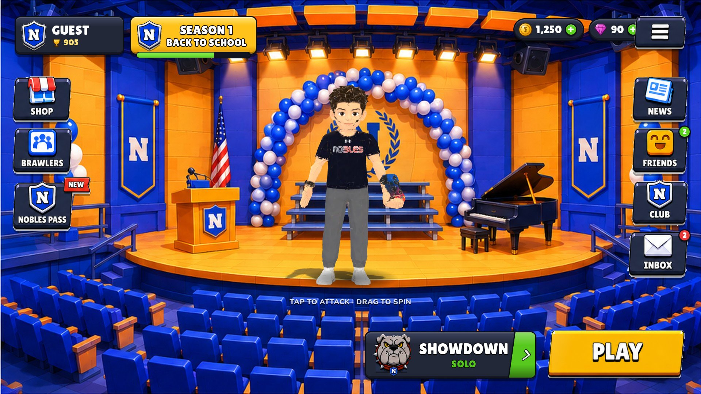

# Nobles Brawl — Menu

A fully interactive, Brawl Stars-style home menu for **Nobles Brawl**. Plain HTML/CSS/JS + three.js, no build step. Every visual is an individual, replaceable file.



## Run it

```bash
# any static server works — the menu is just files
npx serve .            # then open http://localhost:3000
# or
python3 -m http.server 8080   # http://localhost:8080
```

Opening `index.html` straight from disk will **not** work (ES modules + fetch need http). GitHub Pages works out of the box: Settings → Pages → deploy from `main` / root.

## What's in the menu

| Screen | What it does |
| --- | --- |
| **Home** | Auditorium stage, live 3D brawler with procedural idle (tap → attack clip, drag → spin), profile plate, season plate with token progress, coins/gems, side buttons, mode selector, PLAY. |
| **Brawlers** | Roster grid (rarity colors, trophies, power, locked state) → detail view with a second live 3D preview, stats, attack/super, trophy road, upgrade (coins) and **Select** (changes the brawler on stage). |
| **Shop** | Special offers, daily deals (free claims, coins/gems purchases with flying currency), gem packs, Star Drop opening with rarity roll (can unlock Kovacs / Henry). |
| **Nobles Pass** | Season header, free / premium lanes, claimable tiers, premium unlock, token progress. |
| **News / Friends / Club / Inbox** | Cards, online friends with invites, club roster + working chat, mail with claimable rewards and unread badges. |
| **Choose Event** | All modes with Nobles-themed maps → detail → select (updates the home mode plate). |
| **PLAY** | Matchmaking lobby that fills with players, MATCH FOUND, hand-off screen to the (future) battle scene, simulated result with trophies/coins/tokens. |
| **Menu / Profile** | Settings (music, SFX, hints, reset), player name change, stats. |

State (currencies, unlocks, claims, name, settings) persists in `localStorage`. Reset it from Settings → Reset progress.

Sounds are synthesized with WebAudio, so there are no audio files to ship. Drop an `.mp3`/`.ogg` path into `assets/manifest.json → audio` to replace any of them (or the music loop).

## Replacing assets

Everything is addressed through **`assets/manifest.json`** — a slot → file map. To swap a button, icon, panel, background, model or font: either overwrite the file in place (same name) or point the slot at a new path. Nothing in the code references image files directly.

```
assets/
  manifest.json          ← the slot map (edit this or replace files in place)
  ui/background/         auditorium_background.jpg      (1920×1080, cover-fitted)
  ui/buttons/            shop, brawlers, nobles_pass, news, friends, club, inbox, menu, play, showdown (@2x PNG)
  ui/icons/              shop, brawlers, news, friends, club, inbox, nobles_shield, bulldog, new_badge
  ui/panels/             guest_panel, season_1_back_to_school (not used by default — rebuilt in CSS so text is live)
  ui/decor/              banner, balloons, flag, speaker, spotlight, platform_tile (spares for future screens)
  ui/generated/          trophy, coin, gem, power_point, star_drop, token, lock, gear, close, back, check, online (SVG)
  portraits/             one 512×512 PNG per brawler (rendered from the GLB — see tools/)
  models/                one GLB per brawler + power_cube.glb
  fonts/                 Lilita One (display) + Nunito (body)
```

Sizing: side buttons render at 128 px tall on a 1080 px-tall stage, so a 256 px-tall PNG (@2x) is ideal. The stage scales to any window/phone; layout is authored at 1920×1080 in `styles.css`.

### Brawlers

`data/brawlers.json` has one entry per brawler: name, rarity, stats, description, model path, portrait, idle stance and which baked clips play on tap. To add a brawler:

1. Export a rigged GLB from Meshy (any Mixamo-style skeleton works: Hips / Spine / LeftArm / …).
2. `npm run optimize -- path/to/model.glb assets/models/newguy.glb` (2048 px WebP textures, ~1–2 MB).
3. `npm run portraits` to render `assets/portraits/newguy.png` (needs the dev server running).
4. Add the entry to `data/brawlers.json`.

The **idle animation is generated at runtime** by `src/idle.js` from the model's rest pose (Meshy exports have no idle clip): arms are brought down into a `ready` (weapon in front) or `relaxed` stance, then breathing, weight-shift, arm sway and head look-around are layered on and baked into a looping clip that cross-fades with the model's real attack/run clips. Tune per brawler with `stance`, `idle.duration`, `idle.seed`.

### Text, modes, shop, news…

All copy and numbers live in `data/game.json` (season, modes + maps, shop items, news, friends, club, inbox, pass rewards). Edit the JSON, refresh.

## Code map

```
index.html            markup for the home HUD + loader
styles.css            design system (plates, buttons, outlines, screens, cards) — all in stage px
src/main.js           boot, stage scaling, home rendering, 3D placement on the stage floor
src/assets.js         manifest loader +  hydration
src/ui.js             h() DOM builder, screen stack, popups, toasts, particles, counters
src/state.js          persistent player state + event bus
src/audio.js          synthesized SFX + music (override via manifest)
src/brawler3d.js      three.js viewer: load/clone GLB, idle, tap→attack, drag→spin, contact shadow
src/idle.js           procedural idle clip generator
src/screens/*.js      brawlers, shop, pass, social (news/friends/club/inbox), settings/profile, play (modes/matchmaking)
tools/                portrait renderer + model optimizer (dev only)
vendor/three/         three.js r185 (MIT)
```

## Deploying

Static hosting, nothing to build. For GitHub Pages: push, then Settings → Pages → Source: `main` / `/ (root)`.

## Pushing to GitHub

The repo is committed locally but not yet on GitHub (no GitHub credentials were available when it was built). From the project folder:

```bash
gh repo create nobles-brawl --public --source=. --push        # with the GitHub CLI
# or, with an empty repo already created on github.com:
git remote add origin https://github.com/<you>/nobles-brawl.git
git push -u origin main
```

Then turn on Pages (Settings → Pages → `main` / root) and the menu is live at `https://<you>.github.io/nobles-brawl/`.
